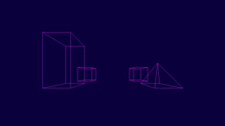

# Swing virtual camera

## Preview

## Controls

* Camera position:
    * Forward / Backward: **w** / **s**
    * Left / Right: **a** / **d**
    * Up / Down: **space** / **ctrl**
* Camera rotation:
    * Forward / Backward: **down** / **up**
    * Left / Right (z-axis): **left** / **right**
    * Left / Right: **q** / **e**
* Zoom in: **1**
* Zoom out: **2**